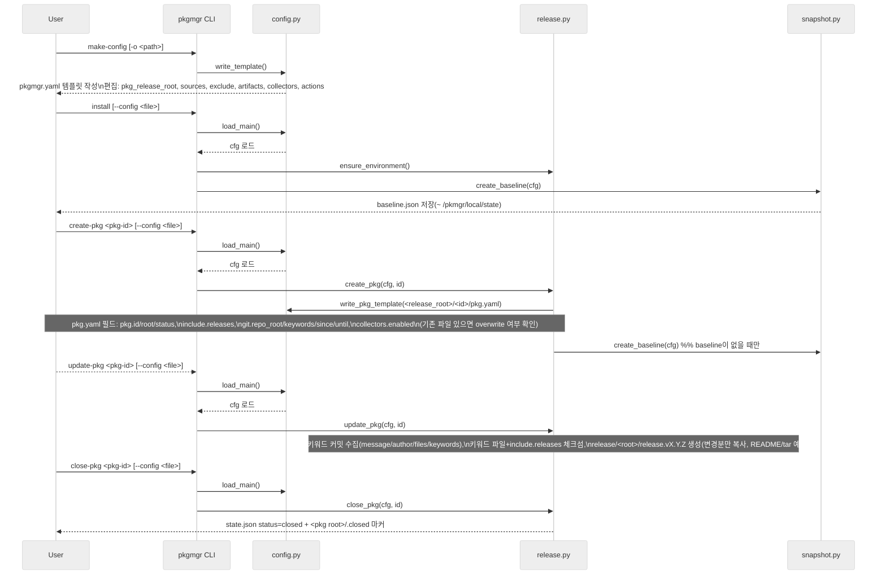

# pkgmgr 흐름 (Mermaid)

## 명령별 설정/동작 요약 (현재 구현 기준)
- make-config: `pkgmgr.yaml` 템플릿 생성 → 편집: `pkg_release_root`, `sources`, `source.exclude`, `artifacts.targets/exclude`, `collectors.enabled`, `actions`, `git.keywords/repo_root`.
- install: `--config` 로딩 → 쉘 PATH/alias 추가 → baseline이 없을 때만 `~/pkgmgr/local/state/baseline.json` 생성.
- create-pkg: `<pkg_release_root>/<pkg-id>/pkg.yaml` 생성(실제 값 채움, 기존 파일 있으면 overwrite 여부 확인) → baseline 없을 때만 생성.
- update-pkg: `git.repo_root`에서 `git.keywords` 매칭 커밋 수집(message/author/files 등) + 키워드 파일/`include.releases` 체크섬 수집 + 릴리스 번들 생성(`release/<root>/release.vX.Y.Z/`, 이전 버전과 diff 후 변경분만 복사, README.txt 작성).
- close-pkg: `<pkg root>/.closed` 마커 생성 + `state.json` status=closed 기록.

## 시퀀스 다이어그램 (주요 명령 흐름)

