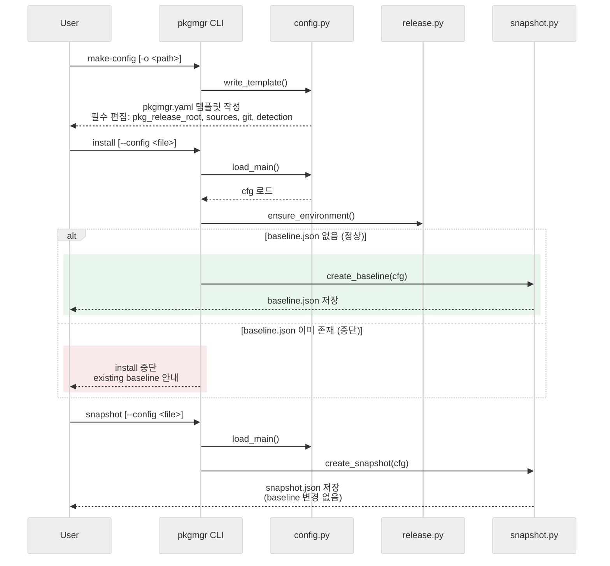
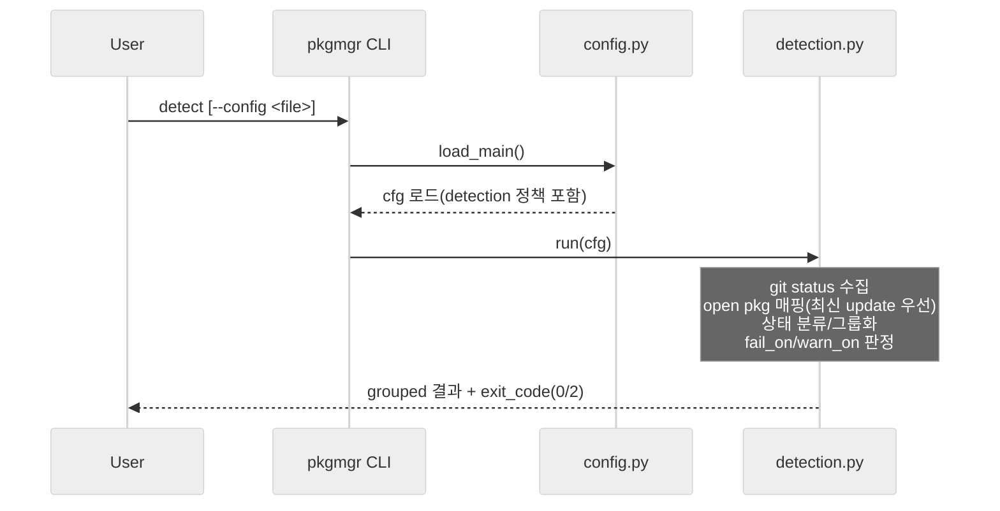
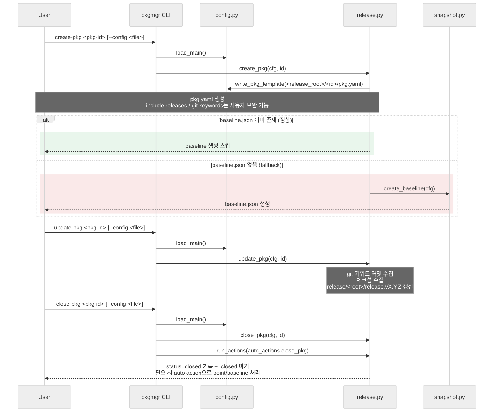

# pkgmgr 흐름 (Mermaid)

## 명령별 설정/동작 요약 (현재 구현 기준)
- make-config: `pkgmgr.yaml` 템플릿 생성 후 `pkg_release_root`, `sources`, `source.exclude`, `artifacts.targets/exclude`, `collectors.enabled`, `actions`, `git.repo_root/repo_url/keyword_prefix`, `detection.*` 편집.
- install: `--config` 로딩 후 쉘 PATH/alias 추가, baseline이 없을 때만 `~/pkgmgr/local/state/baseline.json` 생성.
- snapshot: 현재 상태를 `~/pkgmgr/local/state/snapshot.json`으로 저장(standalone, baseline 미변경).
- create-pkg: `<pkg_release_root>/<pkg-id>/pkg.yaml` 생성(기존 파일 있으면 overwrite 확인), baseline 없을 때만 생성.
- update-pkg: `git.repo_root`에서 `git.keywords` 매칭 커밋 수집 + 체크섬 수집 + 릴리스 번들 생성.
- close-pkg: `<pkg root>/.closed` 마커 생성 + `state.json` status=closed 기록 + `auto_actions.close_pkg` 실행(설정 시).
- detect: git 변경 수집 -> open pkg 자동 매핑(다중 후보면 최신 update 우선) -> 상태 분류 -> grouped 출력 + 정책 기반 exit code.

## 설치 및 초기정보 생성 흐름

```mermaid
%%{init: {'theme':'neutral'}}%%
sequenceDiagram
    participant U as User
    participant CLI as pkgmgr CLI
    participant CFG as config.py
    participant REL as release.py
    participant SNAP as snapshot.py

    U->>CLI: make-config [-o <path>]
    CLI->>CFG: write_template()
    CFG-->>U: pkgmgr.yaml 템플릿 작성<br/>필수 편집: pkg_release_root, sources, git, detection

    U->>CLI: install [--config <file>]
    CLI->>CFG: load_main()
    CFG-->>CLI: cfg 로드
    CLI->>REL: ensure_environment()
    alt baseline.json 없음 (정상)
        rect rgba(120, 200, 140, 0.16)
            CLI->>SNAP: create_baseline(cfg)
            SNAP-->>U: baseline.json 저장
        end
    else baseline.json 이미 존재 (중단)
        rect rgba(220, 120, 120, 0.16)
            CLI-->>U: install 중단<br/>existing baseline 안내
        end
    end

    U->>CLI: snapshot [--config <file>]
    CLI->>CFG: load_main()
    CLI->>SNAP: create_snapshot(cfg)
    SNAP-->>U: snapshot.json 저장<br/>(baseline 변경 없음)
```

## detect 흐름

```mermaid
%%{init: {'theme':'neutral'}}%%
sequenceDiagram
    participant U as User
    participant CLI as pkgmgr CLI
    participant CFG as config.py
    participant DET as detection.py

    U->>CLI: detect [--config <file>]
    CLI->>CFG: load_main()
    CFG-->>CLI: cfg 로드(detection 정책 포함)
    CLI->>DET: run(cfg)
    note over DET: git status 수집<br/>open pkg 매핑(최신 update 우선)<br/>상태 분류/그룹화<br/>fail_on/warn_on 판정
    DET-->>U: grouped 결과 + exit_code(0/2)
```

## pkg 관리 흐름

```mermaid
%%{init: {'theme':'neutral'}}%%
sequenceDiagram
    participant U as User
    participant CLI as pkgmgr CLI
    participant CFG as config.py
    participant REL as release.py
    participant SNAP as snapshot.py

    U->>CLI: create-pkg <pkg-id> [--config <file>]
    CLI->>CFG: load_main()
    CLI->>REL: create_pkg(cfg, id)
    REL->>CFG: write_pkg_template(<release_root>/<id>/pkg.yaml)
    note over REL,U: pkg.yaml 생성<br/>include.releases / git.keywords는 사용자 보완 가능
    alt baseline.json 이미 존재 (정상)
        rect rgba(120, 200, 140, 0.16)
            REL-->>U: baseline 생성 스킵
        end
    else baseline.json 없음 (fallback)
        rect rgba(220, 120, 120, 0.16)
            REL->>SNAP: create_baseline(cfg)
            SNAP-->>U: baseline.json 생성
        end
    end

    U->>CLI: update-pkg <pkg-id> [--config <file>]
    CLI->>CFG: load_main()
    CLI->>REL: update_pkg(cfg, id)
    note over REL: git 키워드 커밋 수집<br/>체크섬 수집<br/>release/<root>/release.vX.Y.Z 갱신

    U->>CLI: close-pkg <pkg-id> [--config <file>]
    CLI->>CFG: load_main()
    CLI->>REL: close_pkg(cfg, id)
    CLI->>REL: run_actions(auto_actions.close_pkg)
    REL-->>U: status=closed 기록 + .closed 마커<br/>필요 시 auto action으로 point/baseline 처리
```
